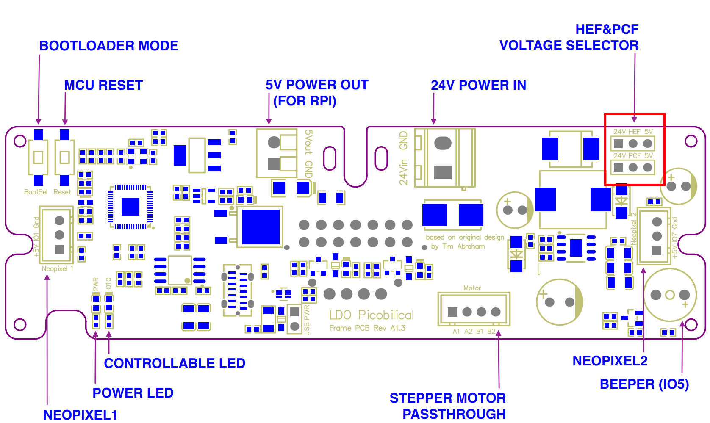
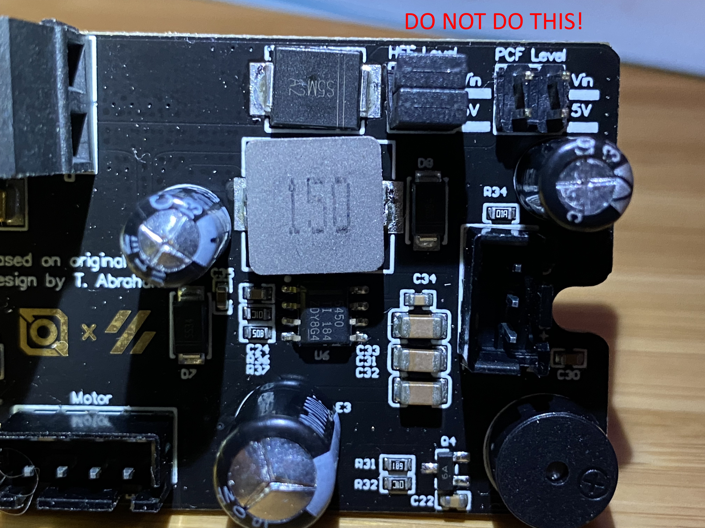
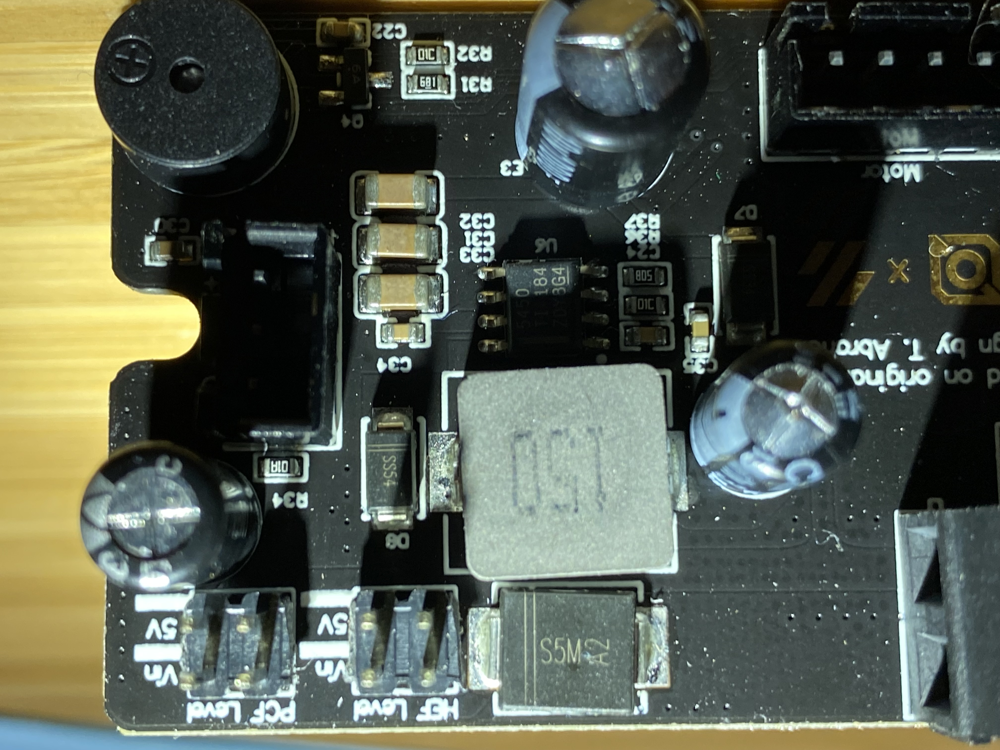
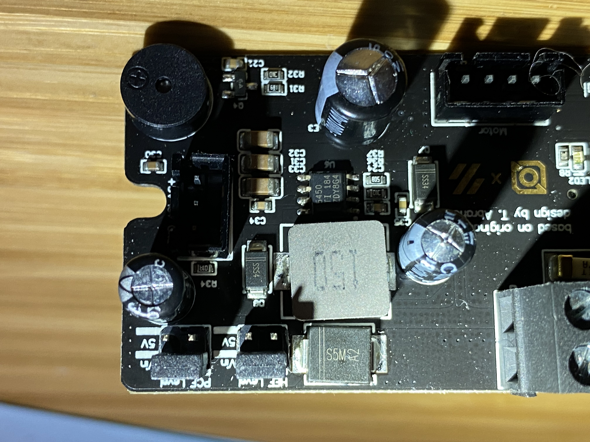

# Picobilical Fan Voltage Mishap

This document describes a mistake that I made that resulted in the destruction of my LDO Picobilical board and the Raspberry Pi in my Voron V0 printer. While ultimate responsibility for this mistake is mine, it due in part to incorrect documentation in the [LDO Picobilical Github repo]([MotorDynamicsLab/LDO-Picobilical (github.com)](https://github.com/MotorDynamicsLab/LDO-Picobilical)).  I am documenting the mistake here to help LDO correct the documentation in the hopes that no one else makes this mistake.

## Fan Jumpers
The Picobilical supports both 5V and 24V (or whatever your VIN voltage is) for the hotend and part-cooling fans. The voltage for each of these fans can be selected independently via jumpers in the upper right hand corner of the fan. 

## Pinout Diagram

The LDO documentation for this board is, at the time of this writing, extremely limited. There is a combined  [schematic]([LDO-Picobilical/Picobilical_A1.3_Schematics.pdf at master · MotorDynamicsLab/LDO-Picobilical (github.com)](https://github.com/MotorDynamicsLab/LDO-Picobilical/blob/master/Hardware/Picobilical_A1.3_Schematics.pdf)) for  the picobilical (umbilical) board and the toolhead board, and a simple ["pinout" diagram]([LDO-Picobilical/Picobilical_A1.3_Pinout.pdf at master · MotorDynamicsLab/LDO-Picobilical (github.com)](https://github.com/MotorDynamicsLab/LDO-Picobilical/blob/master/Hardware/Picobilical_A1.3_Pinout.pdf)) for the umbilical board.  Unfortunately, the fan voltage jumpers shown in this diagram do not match the shipping hardware. Here is a screen cap of this with the jumpers highlighted (red rectangle):

Note that this diagram shows two, three-pin, jumperable headers, with the hot-end fan header on top, and the part-cooling fan on bottom. Looking at this diagram, to set both fans for 24V,  you would put jumpers on the far left hand side of both headers. 

## Misconfigured Jumpers - Board Goes Pop!

This is what I did that destroyed my board:

This configuration, however, shorts 24V to 5V. In my case, it destroyed the picobilical (you can see the two large, electroytic capacitors it destroyed in this photo) as well as my Raspberry Pi. Given the difficulty and/or expense of getting Raspberry Pi these days, this was a real set-back. 

## Actual Board Jumper Configuration

To see why this configuration is wrong, let's look at a photo of the board with no jumpers installed:

Here you can see that the jumpers for the fans are split left and right and the voltages top and bottom, as not fans on top and bottom and voltages on left and right as shown in the diagram. In addition to the documentation being dangerously misleading, this way of laying out jumpers on the board is suboptional because it makes this kind of mistake possible. A better way of laying out the jumpers is as shown in the pinout diagram, with the two rows of headers spaced far enough apart that a jumper can not be placed across rows. I assume this was a late-breaking change that the LDO PCB designer made in  order to fit things on the board. 

## Correct Jumper Configuration for 24V PCF and 24V HEF

The photo below shows the correct jumpering for both fans at 24V:

