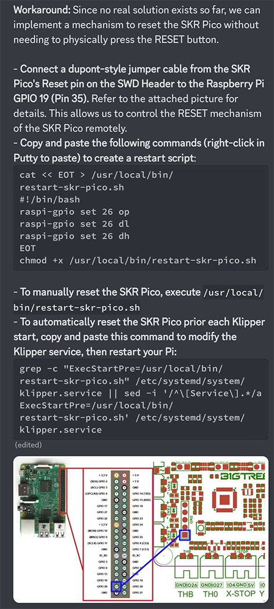

## Description of the Problem
This is a brief note to document an issue I have experienced with some 3D printer related controller boards that utilize the RP2040 chip from the Raspberry Pi Foundation. The issue manifests when one of these RP2040-based boards is plugged in via USB to a Raspberry Pi. The issue will occur when you reboot the Raspberry Pi without power cycling the RP2040 device. When the Raspberry Pi finishes booting, the RP2040 device will not be recognized. Resetting the RP2040 will resolve the issue, as will doing a full cold boot of both the Raspberry Pi and the RP2040.

I have experienced or heard of this problem with these RP2040 based solutions:
* The LDO Picobilical board. I have only one of these to test, but the problem consistently repros with this board.
* Seeed XIAO RP2040 boards - I made my own board that used one of these to allow connecting an ADXL345 accelerometer to the Raspberry Pi via a USB cable. Notably, I switched to another XIAO board, and the problem did not recur. This is what makes me suspect that the issue is only with certain RP2040 steppings.
* BTT SKR Pico controller boards. 

**This issue only impacts the B0 and B1 steppings of the RP2040; B2 and later steppings do not have this issue.**

## Reproducing the Problem with the LDO Picobilical
Go through the steps below to reproduce the problem when connected to the LDO board.
1. Go through the instructions from LDO to flash Klipper firmware onto the RP2040
2. Starting with the power to the printer (and the Raspberry Pi, aka Rpi) completely off, power on the printer.
3. After the printer boots, ssh into the Raspberry Pi
4. Install the `uhubctl` utility if it's not already there:
```
   sudo apt install uhubctl
```
5. Verify that you can see the Picobilical RP2040 device by running: `lsusb` . 
6. Run `sudo uhubctl` to see the current USB devices and to which hub and ports they are connected. You should see the RP2040 device there too. 
7. Reboot the Raspberry Pi without shutting off the power to the printer:
```
   sudo reboot
```
8. After the Raspberry Pi reboots, SSH back into it and run `lsusb` again. If you see the Picobilical RP2040 in the list, your Picobilical is not impacted by this bug. For me, however, the RP2040 no longer shows up. **Klipper fails to start because it can't find the Picobilical MCU.** 
   
    
   
9.  And here is an example of the error you will see from Klipper after rebooting the Raspberry Pi without power cycling the printer:

     

## Workaround for USB Bus Powered Devices
For RP2040 devices that are powered directly by USB, it is possible to work around the issue by using uhubctl to power cycle the RP2040. **Unfortunately, this won't work with the Picobilical, because its RP2040 gets its power indirectly from the printer's 24V PSU.**

To use the work around for other devices, you would note the hub and port as shown with a red underline in the `uhubctl` results shown above. Then run this command:
```
sudo uhubctl -a cycle -d 3 -w 1000 -R -l <hub> -p <port>
```
Replacing `<hub>` and `<port>` with values shown above, this would be:
```
sudo uhubctl -a cycle -d 3 -w 1000 -R -l 1-1 -p 2
```
## A Software Fix ##

The Raspberry Pi Pico SDK contains some code to workaround this issue. The code can be found in the function, `rp2040_usb_device_enumeration_fix()`, within the file `src\rp2_common\pico_fix\rp2040_usb_device_enumeration\rp2040_usb_device_enumeration.c`. In the comments in this function, it mentions that the workaround requires that GPIO15 is used, so obviously applications that use this pin for other purposes may have issues.

I have not determined if the Klipper team is aware of this or has considered integrating this fix, but I plan on following up on that soon.

## A Hardware Fix? ##

As mentioned above, if one resets the RP2040 after the Raspberry Pi has booted, when the RP2040 resumes the Raspberry Pi will detect it. In some cases, it is possible to connect the RP2040 reset circuitry to a GPIO pin on the Raspberry Pi. The LDO folks have documented a way to do this for the BTT SKR Pico that they ship in one of their kits. I've included a screenshot of this note below. 

In my case, I needed a fix for the LDO Picobilical. The LDO fix for the SKR Pico utilizes the fact that this board has a SWD header and one of the pins on that header is connected to the RP2040 reset. Unfortunately, this is not the case for the Picobilical. So I soldered a wire to the inward facing pad on the reset switch on the Picobilical, and ran this to a pin on the Raspberry Pi expansion header. The RPI can then use GPIO to reset the Picobilical as needed. 

The yellow wire in this photo is the one that goes to the Raspberry Pi's GPIO. It is soldered to the inside pad on the Reset button on the Picobilical board. I've used some hot glue to give the wire a little strain relief (ugly soldering job, I know...).


This photo shows where I have connected the wire to the Raspberry Pi's expansion header. I used a Dupont connector to attach the wire to pin 37 (GPIO 26) on the expansion header. 


Yes, I know, it's an ugly solution. But it works. See the next section for details on how to automate the software portion of this.

### Resetting the Picobilical Before Klipper Starts ###

To automate the reset of the Picobilical, we will create a script to perform the task, and a systemd service to run this script after boot before the Klipper service is started. To create the script, ssh into your Raspberry Pi and run these four commands:


```
$ cat <<EOF | sudo tee /usr/local/sbin/restart-picobilical.sh
#!/bin/bash
raspi-gpio set 26 op
raspi-gpio set 26 dl
raspi-gpio set 26 ip
sleep 1
EOF

$ sudo chmod +x /usr/local/sbin/restart-picobilical.sh

$ cat <<EOF | sudo tee /etc/systemd/system/restart-picobilical.service
[Unit]
Description=Toggle GPIO26 to reset the Picobilical
RequiredBy=klipper.service

[Service]
ExecStart=/usr/local/sbin/restart-picobilical.sh

[Install]
WantedBy=multi-user.target
EOF

$ sudo systemctl enable --now restart-picobilical.service
```

To test it, you can reboot your Raspberry Pi now. Klipper should come up and recognize the Picobilical as normal.


### LDO Workaround for BTT SKR Pico

Here is the BTT SKR Pico hardware-based fix that LDO shared, and which gave me the idea for the Picobilical solution described above.



 