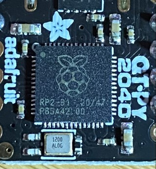
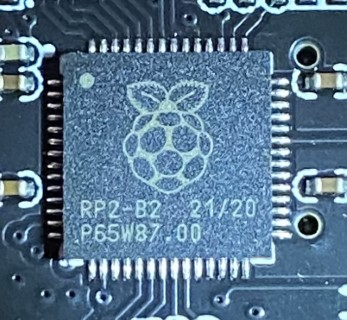
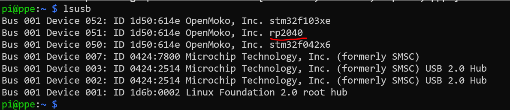
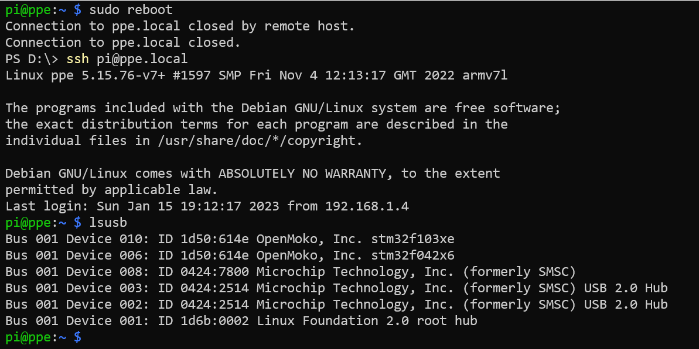
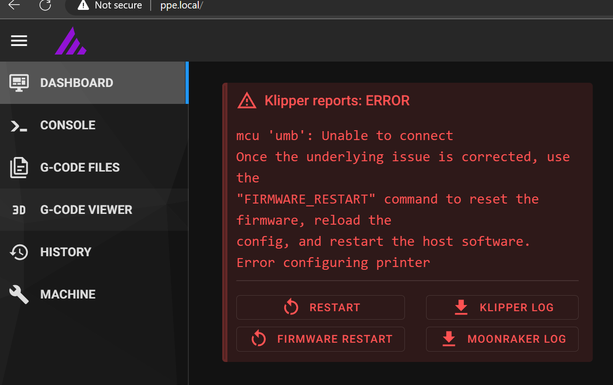
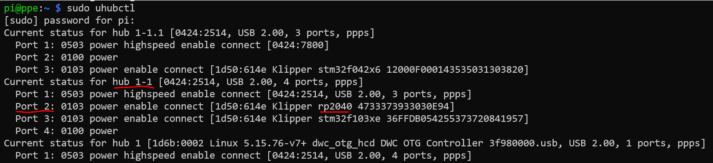
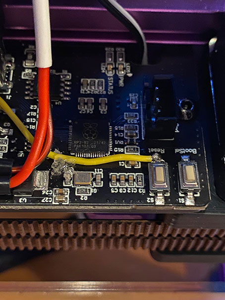
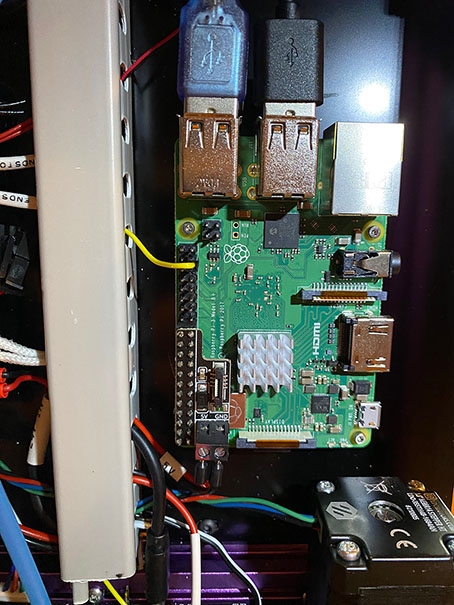

## RP2040 USB Bug
This is a brief note to document an issue I have experienced with some 3D printer related controller boards that utilize the RP2040 chip from the Raspberry Pi Foundation. The issue manifests when one of these RP2040-based boards is plugged in via USB to a Raspberry Pi. Upon initial power up of both devices, everything functions normally. However, if you reboot the Raspberry Pi without resetting or cycling power to the RP2040, the Raspberry Pi will not complete a USB connection to the RP2040 and it will vanish from the bus. Power cycling or resetting the RP2040 resolves the issue.

This problem is caused by a bug in the first stage bootloader that is encoded in the (hardened) ROM on the RP2040. Because this bootloader is contained in the device's ROM, it can not be flashed to install an update that fixes the bug. 

I have personally observed or seen reports of this issue on a number of RP2040-based boards, including BigTreeTech SKR Pico, LDO Picobilical, and various "portable input shaper" solutions.

## Impacted Devices

At least one of the USB issues only occurs on RP2040 of the B0 and B1 steppings. RP2040 with steppings of B2 and later made a change to fix a USB issue. However, there are still reports of USB-related boot visibility issues on devices with the B2 stepping, so it seems it is more complicated than a single bug that was fixed.

The RP2040 stepping is laser-etched on the top of the chip. In the pictures of RP2040 below, you can see an "RP2-B1" on one device, and an "RP2-B2" - on the other. The "B1" and "B2" in these photos indicate the stepping of the device.

    

## Reproducing the Problem

Follow the steps below if you have an RP2040 based device and want to confirm it has the issue, test potential fixes, or otherwise reproduce the issue.

1. Flash whatever firmware (for example, Klipper) is desired on the RP2040 device following the instructions from the manufacturer or software provider.
2. Power off both devices.
3. If not already connected, connect the RP2040 device to the Raspberry Pi via the appropriate USB cable. It does not matter which port on the Raspberry Pi you use.
4. Power on both devices.
5. After the printer boots, `ssh` into the Raspberry Pi
6. Run `lsusb` to observe that the RP2040 is present on the USB bus and detected by the Raspberry Pi. Example:

 

7. Reboot the Raspberry Pi without taking any steps that would power it or the RP2040 off.
```
   sudo reboot
```
8. After the Raspberry Pi reboots, SSH back into it and run `lsusb` again. If you have an RP2040 with the B2 stepping or later, you will still see the RP2040 in the list. However, if you have one with B0 or B1 steppings, it will no longer show up in the USB output. Example:
   
     
   
   This error is commonly seen with Klipper. The symptom there will be that Klipper will not start because it can't find one of its configured MCU. Example:

     

## Workaround for USB Bus Powered Devices
For RP2040 devices that are powered directly by USB, it is possible to work around the issue by using uhubctl to power cycle the RP2040. Note that this won't work for many 3D printer controllers and add-on boards because they are typically powered via an external power supply. However, for those devices that get power via the Raspberry Pi's USB, this might be a viable workaround.

1.  Install the `uhubctl` utility on the Raspberry Pi:
```
   sudo apt install uhubctl
```
2. Verify that you can see the RP2040 device by running: `lsusb` . 
3. Run `sudo uhubctl` to see the current USB devices and to which hub and ports they are connected. You should see the RP2040 device there too. Take note of the hub number and port number to which the RP2040 is connected (underlined in red in the following screenshot)
   
    

4. Reboot the Raspberry Pi to generate the issue as described above. 
5. After the Raspberry Pi boots, `ssh` back into it and confirm the device no longer appears on `lsusb` or `uhubctl`
6. Run this command. 
```
sudo uhubctl -a cycle -d 3 -w 1000 -R -l <hub> -p <port>
```
Replace `<hub>` and `<port>` with the values you noted from step 3 above. Using the numbers shown in the screenshot, this would be:
```
sudo uhubctl -a cycle -d 3 -w 1000 -R -l 1-1 -p 2
```
7. Run `lsusb` or `uhubctl` to confirm the RP2040 now shows up. You may have to repeat step 6 if it does not immediately work; success depends on what other USB traffic is on the same hub as the RP2040.

If this workaround is successful for you, you can create a Linux systemd service to perform these steps on boot. 
## A Software Workaround ##

The Raspberry Pi Pico SDK contains some code to workaround this issue. The code can be found in the function, `rp2040_usb_device_enumeration_fix()`, in [this source file](https://github.com/raspberrypi/pico-sdk/blob/master/src/rp2_common/pico_fix/rp2040_usb_device_enumeration/rp2040_usb_device_enumeration.c)

Note the comment within this function:

```
// After coming out of reset, the hardware expects 800us of LS_J (linestate J) time
// before it will move to the connected state. However on a hub that broadcasts packets
// for other devices this isn't the case. The plan here is to wait for the end of the bus
// reset, force an LS_J for 1ms and then switch control back to the USB phy. Unfortunately
// this requires us to use GPIO15 as there is no other way to force the input path.
// We only need to force DP as DM can be left at zero. It will be gated off by GPIO
// logic if it isn't func selected.
```
In particular, note the comment about the workaround requiring GPIO15. If your board is using this GPIO pin for other purposes, obviously this will not be an option for you. Of the devices mentioned above, unfortunately the BTT Pico utilizes GPIO15 to drive the enable pin of the extruder stepper (E0). However, other boards, for example the LDO Picobilical, do not utilize this port, and so this workaround would potentially be an option.

The Klipper team is aware of a variation of this bug described in the same RP2040 Errata. They implemented a workaround, however this workaround does not address the issue where the RP2040 is powered independently of the Raspberry Pi. 

You can see discussion of the issue in [this thread](https://github.com/Klipper3d/klipper/pull/4748) on the Klipper Github. However, note [this comment](https://github.com/Klipper3d/klipper/pull/4748#issuecomment-945929322) from Kevin O'Conner. 

So from this it is clear that they have chosen not to implement the more extensive workaround that would be required to solve this issue for the specific conditions described here (RPi boots, RP2040 stays powered).

## A Hardware Hack ##

As mentioned above, if one resets the RP2040 after the Raspberry Pi has booted, when the RP2040 resumes the Raspberry Pi will detect it. In some cases, it is possible to connect the RP2040 reset circuitry to a GPIO pin on the Raspberry Pi. The LDO folks have documented a way to do this for the BTT SKR Pico that they ship in one of their kits. 

In my case, I needed a fix for the LDO Picobilical. The LDO fix for the SKR Pico utilizes the fact that this board has a SWD header and one of the pins on that header is connected to the RP2040 reset. Unfortunately, this is not the case for the Picobilical. So I soldered a wire to the inward facing pad on the reset switch on the Picobilical, and ran this to a pin on the Raspberry Pi expansion header. The RPI can then use GPIO to reset the Picobilical as needed. 

### Connecting a Raspberry Pi GPIO to the RP2040 Reset Pin

The yellow wire in this photo is the one that goes to the Raspberry Pi's GPIO. It is soldered to the inside pad on the Reset button on the Picobilical board. I've used some hot glue to give the wire a little strain relief (ugly soldering job, I know...).



This photo shows where I have connected the wire to the Raspberry Pi's expansion header. I used a Dupont connector to attach the wire to pin 37 (GPIO 26) on the expansion header. 



Yes, I know, it's an ugly solution. But it works. See the next section for details on how to automate the software portion of this.

### Resetting the Picobilical Before Klipper Starts ###

To automate the reset of the Picobilical, we will create a script to perform the task, and a systemd service to run this script after boot before the Klipper service is started. To create the script, ssh into your Raspberry Pi and run these four commands:


```
$ cat <<EOF | sudo tee /usr/local/sbin/restart-picobilical.sh
#!/bin/bash
raspi-gpio set 26 op
raspi-gpio set 26 dl
raspi-gpio set 26 ip
sleep 1
EOF

$ sudo chmod +x /usr/local/sbin/restart-picobilical.sh

$ cat <<EOF | sudo tee /etc/systemd/system/restart-picobilical.service
[Unit]
Description=Toggle GPIO26 to reset the Picobilical
RequiredBy=klipper.service

[Service]
ExecStart=/usr/local/sbin/restart-picobilical.sh

[Install]
WantedBy=multi-user.target
EOF

$ sudo systemctl enable --now restart-picobilical.service
```

To test it, you can reboot your Raspberry Pi now. Klipper should come up and recognize the Picobilical as normal.
